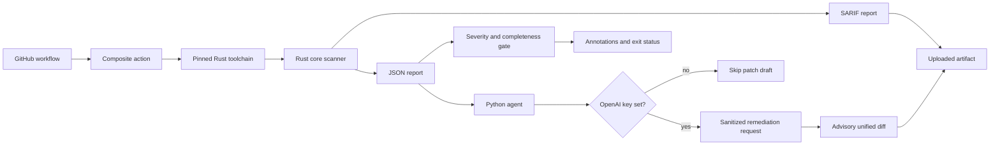

# sec-guard-action

[](https://github.com/dabdul-wahab1988/sec-guard-action/actions/workflows/ci.yml)
[](https://github.com/dabdul-wahab1988/sec-guard-action/blob/main/LICENSE)
[](https://github.com/dabdul-wahab1988/sec-guard-action/releases)
[](https://securityscorecards.dev/viewer/?uri=github.com/dabdul-wahab1988/sec-guard-action)

`sec-guard-action` is an open-source GitHub Action for lightweight repository security checks. It combines a deterministic Rust scanner with an optional Python agent that can ask OpenAI to draft a remediation patch. The action emits JSON and SARIF reports, creates workflow annotations, uploads its results as an artifact, and fails the job when a finding meets the configured severity threshold.

The composite action currently supports Linux runners, including `ubuntu-latest`. It does not modify the checkout, apply generated patches, or open pull requests automatically.

## Architecture



- The Rust core at [`crates/sec-guard-core`](https://github.com/dabdul-wahab1988/sec-guard-action/tree/main/crates/sec-guard-core) walks eligible text files, applies deterministic rules, records scan completeness, parses Rust and Python files with Tree-sitter, records repository metadata through `git2`, and serializes stable JSON and SARIF reports.
- The Python agent at [`python/sec_guard/sec_guard`](https://github.com/dabdul-wahab1988/sec-guard-action/tree/main/python/sec_guard/sec_guard) validates the report with Pydantic, optionally reads non-secret GitHub repository metadata, and uses the OpenAI Responses API to draft a unified diff. Secret-rule findings do not send source excerpts; other excerpts are bounded and secret-pattern redacted.
- Results are written under the runner temporary directory and exposed through action outputs. The report, SARIF file, and any patch draft are uploaded as the `sec-guard-results` artifact for review.

## Quick start

Add this workflow to the repository you want to check:

```yaml
name: Security guard

on:
  pull_request:
  push:
    branches: [main]

permissions:
  contents: read
  pull-requests: read

jobs:
  sec-guard:
    runs-on: ubuntu-latest
    steps:
      - name: Check out the repository
        uses: actions/checkout@11bd71901bbe5b1630ceea73d27597364c9af683 # v4.2.2

      - name: Run sec-guard-action
        id: sec-guard
        uses: dabdul-wahab1988/sec-guard-action@v1
        with:
          openai_api_key: ${{ secrets.OPENAI_API_KEY }}
          github_token: ${{ secrets.GITHUB_TOKEN }}
          severity_threshold: high
```

`openai_api_key` is optional. Without it, the deterministic scan, report, SARIF output, annotations, artifact upload, and severity gate still run while patch drafting is skipped. The `v1` reference is the supported major release line; use a reviewed commit SHA when your organization requires immutable action references.

## Inputs

| Input | Required | Default | Description |
| --- | --- | --- | --- |
| `openai_api_key` | No | `''` | OpenAI API key used for optional remediation-patch drafting. |
| `github_token` | No | `''` | GitHub token used for optional repository metadata lookup. `${{ secrets.GITHUB_TOKEN }}` is recommended. |
| `severity_threshold` | No | `high` | Minimum finding severity that fails the job: `info`, `low`, `medium`, `high`, or `critical`. |
| `model` | No | `gpt-4.1-mini` | OpenAI model used for optional patch drafting. |
| `ignore_file` | No | `.sec-guardignore` | Workspace-relative line-based ignore file. |

## Outputs and artifacts

| Output | Description |
| --- | --- |
| `report_path` | Absolute path to the JSON report. |
| `sarif_path` | Absolute path to the SARIF 2.1.0 report. |
| `patch_path` | Path for the optional advisory unified diff. |
| `blocking_findings` | Number of findings at or above the configured threshold. |
| `scan_complete` | `true` only when no eligible file was too large, unreadable, or non-UTF-8. |
| `exit_code` | `0` passed, `1` severity gate failed, `2` scan/report was invalid or incomplete. |

The action uploads the JSON report, SARIF report, and any patch draft to the short-lived `sec-guard-results` artifact. Patch drafts are advisory and must be reviewed before application.

## Ignore file and scan completeness

`.sec-guardignore` accepts blank lines, comments beginning with `#`, directory prefixes such as `test-fixtures/secrets/`, and simple globs such as `*.pem`. Default build and dependency directories (`.git`, `.venv`, `node_modules`, `target`, `vendor`, and similar paths) are skipped and counted in the report.

Files larger than 1 MiB, invalid UTF-8 files, and read errors are recorded in `scan_summary` and make `scan_complete` false. The Python gate then fails closed with exit code `2`, so a partial scan cannot silently pass. Non-text files are intentionally skipped and counted; syntax errors in Rust and Python files are reported for visibility but do not replace the content rules.

## Security rules

The initial rules are intentionally small and reviewable:

- `SEC001`: credential-shaped assignments such as API keys, tokens, secrets, or passwords.
- `SEC002`: possible AWS access key identifiers.
- `SEC003`: PEM private-key headers.
- `SEC004`: possible GitHub personal access tokens.
- `SEC005`: direct dynamic `eval(` calls.

Evidence is redacted in the Rust report for every rule so a co-located secret cannot be copied into an artifact accidentally. When patch drafting is enabled, source context for `SEC001`–`SEC004` is omitted, and bounded context for other findings is sanitized before it is sent to OpenAI. Treat the generated patch and uploaded artifact as sensitive workflow outputs and review your organization’s data-handling policy before enabling the API integration.

## Local development

The repository contains one Rust workspace member and one installable Python package:

```text
sec-guard-action/
├── .github/workflows/ci.yml
├── .sec-guardignore
├── action.yml
├── Cargo.toml
├── crates/sec-guard-core/
│   ├── Cargo.toml
│   └── src/
│       ├── main.rs
│       └── models.rs
├── python/sec_guard/sec_guard/
│   ├── agent.py
│   ├── codex_client.py
│   ├── models.py
│   └── __main__.py
├── requirements-runtime.txt
├── requirements-test.txt
├── rust-toolchain.toml
├── pyproject.toml
└── tests/
```

Run the pinned Rust checks:

```bash
rustup toolchain install 1.88.0 --profile minimal --component rustfmt --component clippy
cargo +1.88.0 fmt --all -- --check
cargo +1.88.0 test --workspace --locked
cargo +1.88.0 clippy --workspace --all-targets --locked -- -D warnings
cargo +1.88.0 run --locked --package sec-guard-core -- --workspace . --output .sec-guard/report.json --sarif-output .sec-guard/report.sarif
```

Run the pinned Python checks:

```bash
python -m pip install -r requirements-runtime.txt -r requirements-test.txt
python -m pip install --no-deps --no-build-isolation -e .
pytest -q
```

All repository links, package metadata, and action references point to [`github.com/dabdul-wahab1988/sec-guard-action`](https://github.com/dabdul-wahab1988/sec-guard-action).

## License

This project is released under the [MIT License](https://github.com/dabdul-wahab1988/sec-guard-action/blob/main/LICENSE). Copyright © 2026 Dickson Abdul-Wahab.
