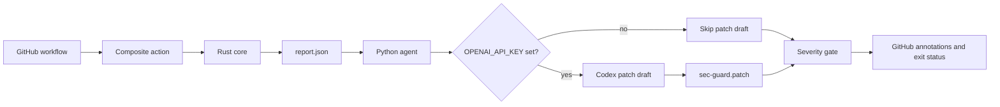

# sec-guard-action

[](https://github.com/dabdul-wahab1988/sec-guard-action/actions/workflows/ci.yml)
[](https://github.com/dabdul-wahab1988/sec-guard-action/blob/main/LICENSE)
[](https://github.com/dabdul-wahab1988/sec-guard-action/releases)

`sec-guard-action` is an open-source GitHub Action for lightweight repository security checks. It combines a fast Rust scanner with an optional Python agent that can ask OpenAI to draft a remediation patch. The action reports findings as JSON, emits GitHub workflow annotations, and fails the job when a finding meets the configured severity threshold.

## Architecture



- The Rust core at [`crates/sec-guard-core`](https://github.com/dabdul-wahab1988/sec-guard-action/tree/main/crates/sec-guard-core) walks the checked-out workspace, applies deterministic regex rules, records repository metadata through `git2`, and serializes a stable report with Serde.
- The Python agent at [`python/sec_guard/sec_guard`](https://github.com/dabdul-wahab1988/sec-guard-action/tree/main/python/sec_guard/sec_guard) validates the report with Pydantic, optionally enriches the request with GitHub repository metadata, and uses the OpenAI Responses API to draft a unified diff. It never applies the generated patch automatically.
- The action is implemented as a composite action, so it runs on a standard Ubuntu runner and keeps the Rust and Python components independently testable.

## Quick start

Add this workflow to the repository you want to check:

```yaml
name: Security guard

on:
  pull_request:
  push:
    branches: [main]

permissions:
  contents: read
  pull-requests: read

jobs:
  sec-guard:
    runs-on: ubuntu-latest
    steps:
      - name: Check out the repository
        uses: actions/checkout@v4

      - name: Run sec-guard-action
        uses: dabdul-wahab1988/sec-guard-action@v1
        with:
          openai_api_key: ${{ secrets.OPENAI_API_KEY }}
          github_token: ${{ secrets.GITHUB_TOKEN }}
          severity_threshold: high
```

`openai_api_key` is optional. Without it, the deterministic scan and severity gate still run, while patch drafting is skipped. The action only writes a proposed patch to the runner's temporary directory; it does not modify the checkout or open a pull request.

## Inputs

| Input | Required | Default | Description |
| --- | --- | --- | --- |
| `openai_api_key` | No | `''` | OpenAI API key used for optional remediation-patch drafting. |
| `github_token` | No | `''` | GitHub token used for optional repository metadata lookup. `${{ secrets.GITHUB_TOKEN }}` is recommended. |
| `severity_threshold` | No | `high` | Minimum finding severity that fails the job: `info`, `low`, `medium`, `high`, or `critical`. |

## Local development

The repository contains one Rust workspace member and one installable Python package:

```text
sec-guard-action/
├── .github/workflows/ci.yml
├── action.yml
├── Cargo.toml
├── crates/sec-guard-core/
│   ├── Cargo.toml
│   └── src/
│       ├── main.rs
│       └── models.rs
├── python/sec_guard/sec_guard/
│   ├── agent.py
│   ├── codex_client.py
│   ├── models.py
│   └── __main__.py
├── pyproject.toml
└── tests/
```

Run the Rust checks:

```bash
cargo fmt --all -- --check
cargo test --workspace --locked
cargo run --locked --package sec-guard-core -- --workspace . --output .sec-guard/report.json
```

Run the Python checks:

```bash
python -m pip install -e ".[test]"
pytest -q
```

The JSON report follows the schema emitted by [`models.rs`](https://github.com/dabdul-wahab1988/sec-guard-action/blob/main/crates/sec-guard-core/src/models.rs). A non-zero Python-agent exit status means that at least one finding is at or above `severity_threshold`.

## Security notes

- Secrets are not printed by the Rust scanner; evidence for secret-shaped matches is redacted.
- OpenAI requests are opt-in and use the `OPENAI_API_KEY` supplied by the workflow environment.
- Generated patches are advisory output. Review them before applying any change.
- For least-privilege workflows, grant only `contents: read` and `pull-requests: read` unless the calling workflow needs additional permissions.

## License

This project is released under the [MIT License](https://github.com/dabdul-wahab1988/sec-guard-action/blob/main/LICENSE). Copyright © 2026 Dickson Abdul-Wahab.
